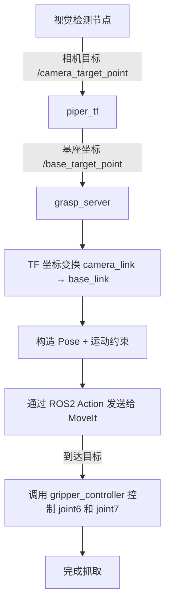

# 🦾 `piper_grasp_control_by_ros` 包说明文档

> **功能**：接收目标抓取点（通常由视觉系统提供），执行抓取动作（调用 MoveIt 进行运动规划 + 执行 + 控制夹爪），是机器人抓取任务的核心控制中心。

---

## 🧩 模块功能概览

- 接收来自视觉系统的抓取目标坐标（`geometry_msgs/PointStamped`）
- 接收用户指定的完整抓取位姿（`geometry_msgs/PoseStamped`）
- 将目标从 `camera_link` 坐标系变换到 `base_link`
- 构造抓取目标约束（位置 + 姿态）
- 通过 ROS 2 Action 发送给 MoveIt，控制机械臂移动至目标位置
- 抓取完成后，调用夹爪控制节点对 `joint6` 旋转、`joint7` 开合 （待完成）

---

## 🚀 工作流程图
初步的设想，姿态控制一直失败，还需要完善




---

## 📦 节点信息

### 节点名：
```bash
grasp_server
```

### 订阅话题：
- `/base_target_point` (类型：`geometry_msgs/PointStamped`)
  - 由 `piper_tf` 转换后发布，表示目标物体在 `base_link` 中的空间坐标
- `/base_target_pose` (类型：`geometry_msgs/PoseStamped`)
  - 用户指定的 XYZ 和四元数姿态，坐标系必须是 `base_link`
  - 收到后优先于 `/base_target_point`，姿态容差为 `0.1 rad`

### 使用 Service：
- `/grasp_command`（类型：`std_srvs/srv/Trigger`）
  - 启动一次抓取流程

### 使用 Action：
- `/move_action`（类型：`moveit_msgs/action/MoveGroup`）
  - 用于将抓取目标位姿发送给 MoveIt 执行抓取规划
---

## 🛠️ 前置依赖

确保以下依赖和配置已经准备好：

| 依赖/配置               | 说明                                                                 |
|------------------------|----------------------------------------------------------------------|
| ✅ 目标点来源           | 发布 `/base_target_point`，目标点坐标应在 `base_link` 下          |
| ✅ TF 坐标树           | `camera_link` → `base_link` 的静态 TF 变换需要用 `static_transform_publisher` 发布 |
| ✅ MoveIt 控制配置     | 已正确加载 URDF、SRDF，规划组名为 `"arm"`，末端执行器 link 为 `"tcp_link"` |
| ✅ `/move_action`       | MoveIt 的 Action Server 已正常运行                                 |
| ✅ `gripper_controller` | 用于控制 `joint6`（夹爪方向） 和 `joint7`（夹爪宽度）               |
| ✅ 抓取触发服务         | `/grasp_command` 使用 `std_srvs/srv/Trigger`                         |

---

## ⚙️ 启动与测试

### 启动 grasp_server：

```bash
source install/setup.bash
ros2 run piper_grasp_control_by_ros grasp_server
```

### 模拟目标点输入（视觉替代）：

```bash
ros2 topic pub --once /base_target_point geometry_msgs/msg/PointStamped "{header: {frame_id: 'base_link'}, point: {x: 0.4, y: 0.0, z: 0.2}}"
```

### 手动指定完整目标位姿：

```bash
ros2 topic pub --once /base_target_pose geometry_msgs/msg/PoseStamped "{header: {frame_id: 'base_link'}, pose: {position: {x: 0.25, y: 0.0, z: 0.25}, orientation: {x: 0.0, y: -0.7071, z: 0.0, w: 0.7071}}}"
```

上述四元数约对应 `roll=0°, pitch=-90°, yaw=0°`。发布目标只会保存，仍需调用 `/grasp_command` 触发规划执行。

目标位置表示夹爪中心 `tcp_link`，不是 J6 法兰中心。实机反馈请查看
`ros2 topic echo /tcp_pose --once`；`/end_pose` 保留为 J6 法兰反馈，因此两者相差一个随姿态旋转的 `0.1468 m` 标定工具偏移。

---

## 🧠 核心流程说明

### 1️⃣ 监听 `/base_target_point`

该节点接收已转换到 `base_link` 的目标点。如原始目标位于 `camera_link`，先由 `piper_tf` 转换并发布到 `/base_target_point`。

### 2️⃣ 构造抓取 `PoseStamped` 和 `Constraints`

- **位置约束**：将目标点设为一个小立方体区域
- **姿态约束**：保持夹爪水平，允许部分旋转自由度（可按任务调整）

### 3️⃣ 异步发送给 MoveIt 并监听反馈

- 创建 MoveIt Action 客户端
- 监听反馈 → 执行成功后进入下一阶段

### 4️⃣ 控制夹爪旋转与开合（调用 gripper_controller）

使用 ROS 2 Action 方式发送抓取角度 + 夹爪宽度。

---

## 🛑 常见问题与调试

| 问题                                                   | 解决方案                                                             |
|--------------------------------------------------------|----------------------------------------------------------------------|
| ⚠️ TF 转换失败：camera_link 不存在                    | 请确认发布了 camera → base_link 的 TF                              |
| ⚠️ MoveIt Action Server 无响应                         | 确保 `move_group` 节点正在运行                                     |
| ⚠️ Link `tcp_link` 不在模型中                         | 重新编译并 source 工作空间，确认 URDF/SRDF 都包含 `tcp_link`       |
| ⚠️ 控制成功但机械臂不动                               | 检查发布的轨迹是否完整、目标位置是否过近或不可达                    |

---

## 🧪 示例测试命令

```bash
# 启动视觉相机 + TF
ros2 run tf2_ros static_transform_publisher 0.3 0.15 0.05 0 0 0 camera_link base_link

# 启动 grasp_server
ros2 run piper_grasp_control_by_ros grasp_server

# 模拟目标点
ros2 topic pub --once /base_target_point geometry_msgs/msg/PointStamped "{header: {frame_id: 'base_link'}, point: {x: 0.4, y: 0.1, z: 0.2}}"

# 最终确认执行动作，没有这个命令 机械臂是不会动的
ros2 service call /grasp_command std_srvs/srv/Trigger "{}"
```

---

## ✅ 下一步建议

- 集成视觉检测 → 自动发送目标点
- 加入抓取失败处理机制（如尝试多个姿态）
- 加入抓取后移动或放置模块
- 集成 TTS/语音指令系统，实现自然语言抓取

---

如果你需要我帮你自动生成对应的 launch 文件、节点间调用结构图，或者更完整的集成例子，也可以直接告诉我💡！
